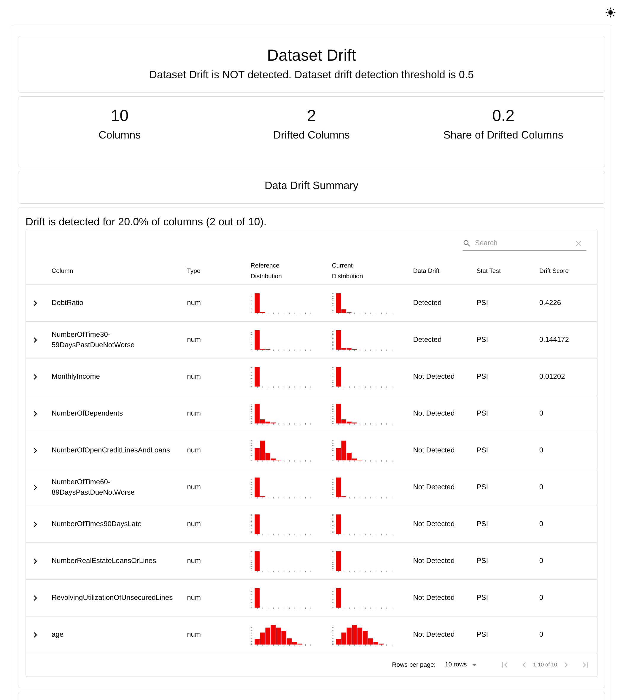
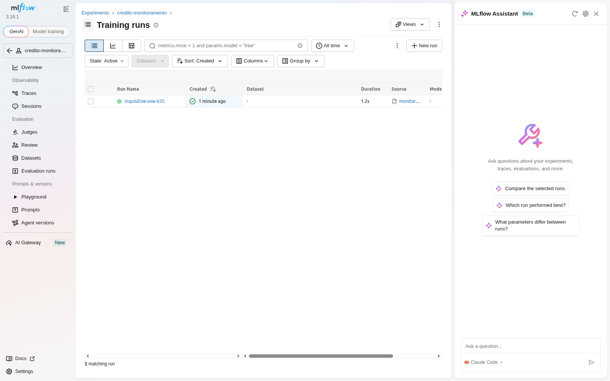
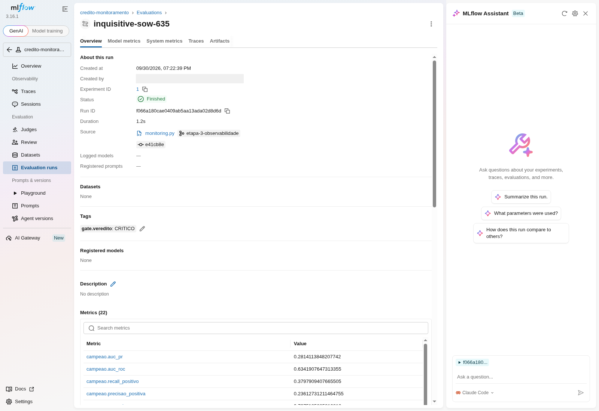
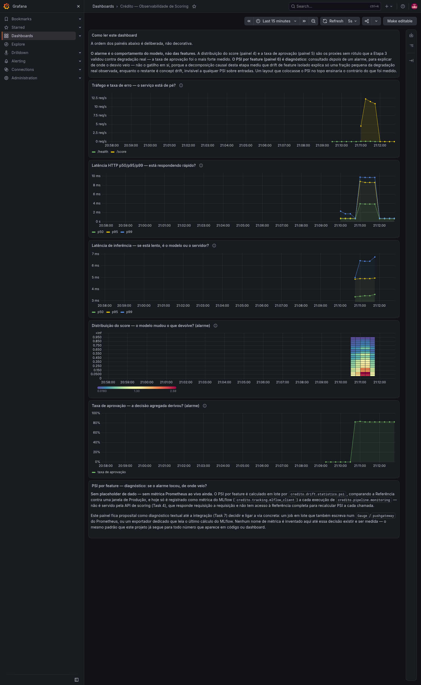

# Risco de Crédito — Sustentação e Confiabilidade

> Camada de sustentação para um modelo de risco de crédito em produção: bloqueia dado
> inválido na ingestão, treina um baseline auditável sobre um Dataset de Referência limpo,
> só publica um modelo novo quando ele passa por um gate de qualidade com pisos medidos e
> monitora a população que chega depois — medindo não só onde ela se deslocou, mas quanto
> esse deslocamento custou ao modelo que está servindo.

---

## O problema

Uma fintech tem um modelo de *credit scoring* em produção e suspeita que ele vem
degradando em silêncio. Silêncio é a palavra: o modelo continua respondendo, continua
rápido, continua com boa acurácia — e ainda assim pode estar identificando cada vez menos
inadimplentes.

Duas causas se confundem quando não há instrumentação:

- **Dado quebrado chegando na entrada.** Um campo que passa a vir nulo, uma coluna com
  código de ausência disfarçado de número. O modelo não reclama: ele pontua.
- **A população mudou.** O dado continua válido, mas não é mais o dado sobre o qual o
  modelo aprendeu.

São problemas diferentes e exigem respostas diferentes, e o repositório os separa em duas
camadas. A primeira estabelece o Dataset de Referência, o contrato que barra dado inválido
antes de qualquer coisa acontecer, o baseline e o gate de promoção. A segunda simula a
passagem do tempo sobre a população, mede o deslocamento com PSI e KS, gera o relatório do
Evidently e — a parte que muda a conclusão — mede o que o deslocamento custou ao modelo
publicado.

A distinção que o código sustenta: **contrato responde "este dado é válido?"** e é falha
dura quando a resposta é não. **Drift responde "este dado é o mesmo de antes?"** — e um
lote com drift passa no contrato, porque dado deslocado continua sendo dado válido. Os seis
lotes simulados desta etapa passam no contrato, todos, com zero violações: é a demonstração
da distinção, não uma coincidência de calibração.

E há uma terceira pergunta, que nenhuma das duas responde: **"e daí?"** — quanto o
deslocamento custa ao modelo que está servindo. PSI e KS são diagnóstico; a degradação
medida é o alarme. A seção de monitoramento mostra, com a decomposição causal desta
execução, que as duas respostas apontam para variáveis diferentes.

---

## Dados

### Fonte

> Credit Fusion and Will Cukierski. *Give Me Some Credit.* Kaggle, 2011.

O arquivo é obtido pela **redistribuição do OpenML (id 46929, licença Public)**, que serve
o mesmo conteúdo por URL pública com checksum. O acesso direto ao Kaggle exige credencial
de conta; um `git clone` limpo e um job de CI não têm essa credencial, e depender dela
tornaria o projeto irreproduzível para qualquer pessoa que não fosse o autor. A escolha é
de engenharia, não de conveniência: reprodutibilidade em clone limpo vale mais do que
usar o endereço canônico.

A integridade é verificada a cada execução contra o md5 fixado em `config.py`
(`6d013a631b97b13d5372f097697e25a1`, 7.226.796 bytes, formato ARFF). Cache íntegro não é
rebaixado.

### Do arquivo bruto ao Dataset de Referência

| | Linhas | Positivos |
|---|---:|---:|
| Arquivo bruto | 150.000 | 10.026 (6,68%) |
| **Dataset de Referência** | **117.917** | **8.186 (6,94%)** |

Retenção de 78,61%. Cada linha descartada é contabilizada por motivo — descarte silencioso
é perda de auditoria:

| Motivo | Linhas |
|---|---:|
| `duplicata` | 646 |
| `renda_nula` | 29.186 |
| `dependentes_nulo` | 0 |
| `idade_invalida` | 1 |
| `atraso_sentinela` | 144 |
| `razao_divida_implausivel` | 2.106 |
| `campo_invalido` | 0 |
| **Total** | **32.083** |

As contagens são **cumulativas, não independentes**: cada filtro opera sobre o que sobrou
do anterior, então a soma é o total real de linhas perdidas, sem dupla contagem. Os dois
zeros são medições, não regras sobrando: `dependentes_nulo` mede 0 porque o filtro de renda
já removeu essas linhas (ver o achado 2 abaixo), e `campo_invalido` mede 0 porque nenhuma
das três colunas sem regra de negócio nomeada chega nula no arquivo — ambos os filtros
existem porque o contrato de ingestão exige o que eles exigem, e não porque o arquivo
atual precise deles.

### Três coisas que o dado revelou

Estes três achados são a razão de o contrato ter a forma que tem. Sem eles, as regras
seriam palpite.

**1. Renda nula e `DebtRatio` absurdo são um defeito só, não dois.**
29.731 linhas do bruto (19,82%) vêm sem `MonthlyIncome`. Nelas, `DebtRatio` guarda a
**dívida bruta** em vez da razão: 90,04% ficam acima de 10, contra 1,75% entre as linhas
que têm renda. O p95 de `DebtRatio` no bruto é 2.449 e o máximo é 329.664; restrito às
linhas com renda declarada, o p95 cai para 1,13. Barrar a renda nula corrige os dois
campos de uma vez.

**2. 100% das 3.924 linhas sem `NumberOfDependents` também estão sem `MonthlyIncome`.**
A ausência é inteiramente co-localizada — não são dois defeitos independentes, é um único
evento de ingestão quebrado com vários sintomas. É por isso que o descarte
`dependentes_nulo` marca **0**: o filtro de renda já removeu essas linhas antes. Esse zero
é evidência do achado, não sinal de regra morta a remover.

**3. As três colunas de atraso carregam os sentinelas 96 e 98 em 269 linhas.**
São marcas de "não disponível" herdadas da coleta original, não contagens. Um cliente que
declara 98 inadimplências de 90 dias é um registro **do tipo certo e semanticamente
impossível** — exatamente a classe de defeito que um contrato de dados intercepta e um
schema de tipos deixa passar.

*(Todos os números acima medidos sobre `data/raw/GiveMeSomeCredit.arff` nesta versão do
repositório.)*

### Duas propriedades que custaram a ser obtidas

**A Referência passa no próprio contrato.** A limpeza e o contrato são uma política só,
expressa duas vezes: cada descarte de `limpar()` é a negação de uma exigência do schema,
uma a uma, sem sobrar nenhuma — e as constantes (`DEBT_RATIO_MAXIMO`, `IDADE_MINIMA`,
`IDADE_MAXIMA`, `ATRASO_MAXIMO_PLAUSIVEL`, `COLUNAS_DE_ATRASO`, `COLUNAS_SEM_REGRA_NOMEADA`)
são **importadas** de um lugar só, não repetidas. Dois testes cobram isso, e cobram por
motivos diferentes: `test_referencia_limpa_passa_no_proprio_contrato` carrega uma linha
por exigência do contrato — inclusive as que só o contrato enxergava, como renda negativa
ou `RevolvingUtilizationOfUnsecuredLines` nula — e
`test_limpeza_cobre_todas_as_colunas_do_contrato` fecha o lado estrutural, exigindo que
toda coluna do schema esteja coberta por uma regra nomeada ou pela lista das estruturais.
Num rascunho anterior as duas divergiam, o que teria matado o pipeline na própria etapa de
validação; num segundo rascunho o teste que deveria pegar isso era construído só com os
defeitos que a limpeza já tratava, e por isso passava sem poder acusar nada.

**O tratamento de desbalanceamento é verificado, não suposto.** Ver a seção de modelo.

---

## Contrato de dados

O contrato é a fronteira de entrada. Roda **antes** do treino e antes de qualquer
inferência — um modelo treinado sobre dado reprovado já nasce comprometido.

A implementação fica atrás de um `Protocol` (`credito.contracts.base.Validator`): as regras
são declaradas uma única vez em `rules.py`, independentes de biblioteca, e o executor
(Pandera) fica trocável sem reescrever regra nem teste de comportamento.

### As seis regras e o defeito medido atrás de cada uma

| Regra | Coluna | Exigência | Defeito medido que a justifica |
|---|---|---|---|
| `renda_nao_nula` | `MonthlyIncome` | não nula, `>= 0` | 29.731 linhas (19,82%) sem renda; 90,04% delas com `DebtRatio > 10` |
| `idade_plausivel` | `age` | entre 18 e 110 | `age` no bruto vai de **0 a 109**; 1 linha abaixo de 18 |
| `sem_duplicatas` | colunas do contrato | sem repetição nas colunas do contrato | 646 linhas repetem outra nas colunas do contrato; 609 repetem a linha inteira, alvo incluído |
| `atraso_plausivel` | 3 colunas de atraso | `<= 20` | 269 linhas com os sentinelas 96 e 98 |
| `dependentes_nao_nulo` | `NumberOfDependents` | não nula, `>= 0` | 3.924 linhas (2,62%), 100% delas também sem renda |
| `razao_divida_plausivel` | `DebtRatio` | entre 0 e 10 | rede de segurança: mesmo com renda válida, 1,75% ainda passam de 10 |

O teto de 10 em `DebtRatio` é uma ordem de grandeza acima do p95 medido entre as linhas com
renda (1,13): generoso o bastante para não reprovar caso atípico legítimo, apertado o
bastante para barrar o defeito conhecido. O teto de 110 em `age` barra erro de digitação
sem reprovar o cliente de 109 anos que existe no arquivo.

### O bloqueio, demonstrado

`make demo-contrato` injeta 5 ocorrências de cada defeito em uma amostra limpa de 500
linhas e mostra os dois desfechos lado a lado. Saída real:

```
=== Lote da Referência (limpo) ===
linhas: 500 | válido: True
ingestão liberada

=== Lote adulterado ===
linhas: 505 | válido: False
  - razao_divida_plausivel (DebtRatio): 5 linha(s)
  - renda_nao_nula (MonthlyIncome): 5 linha(s)
  - dependentes_nao_nulo (NumberOfDependents): 5 linha(s)
  - atraso_plausivel (NumberOfTimes90DaysLate): 5 linha(s)
  - idade_plausivel (age): 5 linha(s)
  - sem_duplicatas (*): 5 linha(s)

INGESTÃO BLOQUEADA: 30 de 505 linha(s) reprovadas — ...
```

As seis regras disparam, cada uma com a contagem exata, e a ingestão é bloqueada. O
relatório é agregado (`lazy=True`): quem está corrigindo um lote precisa ver **todos** os
problemas de uma vez, não o primeiro.

---

## Modelo baseline

### Por que AUC-PR e recall da classe positiva, e não acurácia

A Referência tem **6,94% de positivos**. Sobre o conjunto de teste, um modelo constante que
responde "não vai inadimplir" para todo mundo obtém:

| Métrica | Modelo constante |
|---|---:|
| Acurácia | **0,9306** |
| Recall da classe positiva | **0,0000** |

93% de acurácia e zero inadimplentes identificados — que é a única coisa que se quer do
modelo. Acurácia, nesse regime, é uma métrica que **premia o modelo inútil**.

As duas métricas que o projeto usa para decidir:

- **AUC-PR** mede a qualidade do ordenamento onde a classe rara importa. A linha de base de
  um ordenador aleatório é a própria taxa de positivos, **0,0694** — é contra isso que o
  número do campeão deve ser lido.
- **Recall da classe positiva** é a métrica de negócio. Aprovar um inadimplente custa o
  valor emprestado; recusar um bom pagador custa a margem. A assimetria é enorme, e AUC-PR
  sozinho não a enxerga.

`auc_roc` é reportado como figura secundária: ele infla com o desbalanceamento e por isso
não decide nada aqui.

### O tratamento de desbalanceamento, medido

Não é refinamento: é o que separa um modelo de uma constante. Comparação real, mesma
arquitetura e mesmos hiperparâmetros, mudando **apenas** o peso da classe, treinada na
partição de treino e avaliada na partição de teste da Referência:

| Regressão logística | Recall positivo | Acurácia | AUC-PR |
|---|---:|---:|---:|
| sem `class_weight` | **0,1436** | 0,9346 | 0,3590 |
| com `class_weight="balanced"` | **0,6213** | 0,8474 | 0,3648 |

O modelo sem tratamento tem **acurácia mais alta** (0,9346 contra 0,8474) e identifica
**um quarto** dos inadimplentes. Quem olhasse só para acurácia escolheria o pior dos dois.
Um teste de controle (`test_nao_colapsa_na_classe_majoritaria`) mantém essa propriedade
verificada na suíte, para os dois candidatos.

### Candidatos e campeão

Dois candidatos, não um: a comparação transforma a escolha do modelo em evidência em vez de
preferência, ao custo de uma chamada a mais no pipeline. O campeão é escolhido pelo **AUC-PR
na validação** — escolher no teste transformaria o teste em parte do treino e a métrica
publicada nasceria otimista.

Partições estratificadas pelo alvo, semente 42: treino 70.749 · validação 23.584 · teste
23.584 linhas (6,94% de positivos em cada).

**Validação** (onde o campeão é escolhido):

| Candidato | AUC-PR | AUC-ROC | Recall + | Precisão + | Acurácia |
|---|---:|---:|---:|---:|---:|
| `regressao_logistica` | 0,3469 | 0,8123 | 0,6237 | 0,2506 | 0,8444 |
| **`xgboost`** | **0,3612** | 0,8437 | 0,6970 | 0,2325 | 0,8192 |

**Campeão `xgboost`, no conjunto de teste** (métricas publicadas):

| Métrica | Valor |
|---|---:|
| AUC-PR | **0,3716** |
| AUC-ROC | 0,8421 |
| Recall da classe positiva | **0,6915** |
| Precisão da classe positiva | 0,2350 |
| Acurácia | 0,8223 |
| Taxa de positivos | 0,0694 |
| Limiar | 0,5 |
| n | 23.584 |

AUC-PR de 0,3716 contra uma linha de base aleatória de 0,0694: **5,4 vezes** melhor que o
acaso. O modelo recupera 69,15% dos inadimplentes ao custo de uma precisão de 23,50% — um
ponto de operação deliberadamente deslocado para o recall, pela assimetria de custo.

### Recorte por faixa etária

Idade é atributo protegido. Afirmar que o modelo não discrimina sem medir por grupo é
afirmação sem evidência. Medido no conjunto de teste:

| Faixa | n | Positivos reais | Taxa de recusa | Recall + | Prob. média |
|---|---:|---:|---:|---:|---:|
| 18-25 | 486 | 8,64% | 34,98% | 0,7857 | 0,381 |
| 26-40 | 5.399 | 10,58% | 31,91% | 0,7671 | 0,390 |
| 41-60 | 11.302 | 7,24% | 21,62% | 0,6822 | 0,304 |
| 61+ | 6.397 | 3,22% | 7,50% | 0,5000 | 0,166 |

A taxa de recusa cai monotonicamente com a idade (34,98% → 7,50%), e a taxa de
inadimplência real também (8,64% → 3,22%). Ou seja: a diferença de tratamento acompanha uma
diferença de risco observada, não é um viés puro. Mas a razão entre os extremos é de **4,7×**
na recusa contra **2,7×** no risco real — o modelo é mais severo com os jovens do que o
risco medido justifica. O recall de 0,5000 na faixa 61+ também é o mais baixo da tabela: o
modelo enxerga pior o inadimplente idoso. São números para discutir viés com dado em vez de
adjetivo; a análise formal de *disparate impact* é trabalho da etapa de governança.

---

## Gate de qualidade

O gate decide se um candidato recém-treinado substitui o modelo em produção. São quatro
critérios: dois pisos absolutos e, quando já existe incumbente, duas não regressões.

| # | Critério | Valor |
|---|---|---|
| 1 | AUC-PR do candidato `>=` piso absoluto | **0,3216** |
| 2 | Recall positivo do candidato `>=` piso absoluto | **0,6415** |
| 3 | AUC-PR `>` o do modelo em produção | — |
| 4 | Recall positivo `>=` o do modelo em produção | — |

### Como os pisos foram calibrados

Os dois pisos ficaram em `0.0` até existir modelo treinado, **de propósito**: um piso
inventado antes da medição é enfeite que sempre passa. Foram fixados a partir das métricas
medidas do campeão no conjunto de teste, menos uma margem de 0,05:

| Piso | Medição de origem | Margem | Valor |
|---|---:|---:|---:|
| `min_auc_pr` | AUC-PR do `xgboost` no teste: 0,3716 | −0,05 | **0,3216** |
| `min_recall_positivo` | Recall + do `xgboost` no teste: 0,6915 | −0,05 | **0,6415** |

A margem absorve a variação natural entre retreinos (reordenação de partição, versão de
biblioteca) sem abrir espaço para uma queda real de qualidade passar batido. Um teste
(`test_pisos_do_gate_estao_calibrados`) trava os valores, para que zerá-los seja uma decisão
visível e não efeito colateral de alguém "destravando o pipeline".

### Os dois desfechos

A distinção mais importante desta etapa:

- **`QualityGateError` — piso absoluto violado.** O modelo não é utilizável: é defeito, o
  run **falha** (saída 1) e alguém precisa investigar.
- **`ModelNotPromoted` — candidato válido que não supera o incumbente.** Desfecho
  **normal**, não defeito. Sobre um dataset estático o retreino reproduz o incumbente, então
  esta é a saída esperada de toda execução periódica depois da primeira. O run **conclui**
  (saída 0) e a orquestração converte isso em *skip*.

Se fossem a mesma exceção, o pipeline periódico ficaria vermelho da segunda execução em
diante e o alarme perderia o sentido. As duas classes são deliberadamente **independentes**
— nenhuma herda da outra, e um teste garante isso.

O gate produz os motivos já **separados por desfecho** (`motivos_de_piso_absoluto` e
`motivos_de_regressao`), e o pipeline decide olhando qual das duas listas veio preenchida.
A decisão já foi tomada procurando `"abaixo do piso"` na prosa dos motivos, que existe para
ser lida por humano no histórico: correto naquele momento, e quebrado no instante em que um
critério novo — um piso de estabilidade de distribuição, por exemplo — escolhesse a mesma
palavra. Um teste (`test_motivo_de_regressao_com_texto_de_piso_continua_sendo_skip`) fixa
que o texto do motivo não decide nada.

### A prova dos dois desfechos, rodando

Sequência real a partir de `models/` e `metrics/` vazios:

**Execução 1 — primeira promoção**

```
$ make train
INFO referência com 117917 linhas; descartes: {'duplicata': 646, 'renda_nula': 29186, ...}
INFO candidato regressao_logistica treinado sobre 70749 linhas
INFO auc_pr=0.3469 auc_roc=0.8123 recall+=0.6237
INFO candidato xgboost treinado sobre 70749 linhas
INFO auc_pr=0.3612 auc_roc=0.8437 recall+=0.6970
INFO campeão na validação: xgboost (auc_pr 0.3612)
INFO auc_pr=0.3716 auc_roc=0.8421 recall+=0.6915
INFO promovido: xgboost
>>> exit=0

$ md5sum models/model.joblib metrics/metrics.json
567d4533bf2f46c425d22e59adcd8aac  models/model.joblib
dc89d46d429058dd109ea6964bed425c  metrics/metrics.json
```

**Execução 2 — piso absoluto violado, o run falha**

```
$ CREDITO_MIN_AUC_PR=0.99 poetry run python -m credito.pipeline.training
...
INFO auc_pr=0.3716 auc_roc=0.8421 recall+=0.6915
ERROR gate de qualidade reprovou o candidato: auc_pr 0.3716 abaixo do piso 0.9900
>>> exit=1

$ md5sum models/model.joblib metrics/metrics.json
567d4533bf2f46c425d22e59adcd8aac  models/model.joblib     <- idêntico
dc89d46d429058dd109ea6964bed425c  metrics/metrics.json    <- idêntico
```

**Execução 3 — retreino idempotente, o run conclui sem promover**

```
$ poetry run python -m credito.pipeline.training
...
INFO auc_pr=0.3716 auc_roc=0.8421 recall+=0.6915
INFO nada a promover: auc_pr 0.3716 não supera o modelo em produção (0.3716)
>>> exit=0

$ md5sum models/model.joblib metrics/metrics.json
567d4533bf2f46c425d22e59adcd8aac  models/model.joblib     <- idêntico
dc89d46d429058dd109ea6964bed425c  metrics/metrics.json    <- idêntico
```

O checksum do modelo publicado é **byte a byte idêntico** nas três verificações: nenhum
candidato recusado encostou no que está servindo. `metrics.json` também não é reescrito por
candidato recusado — ele descreve **quem está em produção**, e um arquivo que descrevesse um
candidato nunca publicado seria enganoso sem que ninguém percebesse lendo o JSON.

### O histórico

`metrics/training_history.jsonl` é *append-only*, uma linha por execução, nunca reescrita —
uma escrita interrompida derruba a última linha, não o arquivo inteiro. As três execuções
acima ficaram registradas com seus motivos:

```
{"carimbo": "...", "candidato": "xgboost", "promovido": true,  "motivos": []}
{"carimbo": "...", "candidato": "xgboost", "promovido": false, "motivos": ["auc_pr 0.3716 abaixo do piso 0.9900", "auc_pr 0.3716 não supera o modelo em produção (0.3716)"]}
{"carimbo": "...", "candidato": "xgboost", "promovido": false, "motivos": ["auc_pr 0.3716 não supera o modelo em produção (0.3716)"]}
```

A execução reprovada é exatamente a que alguém vai querer auditar depois — por isso o
registro acontece **antes** de qualquer exceção ser levantada, e não some por o run ter
terminado em erro. É o que permite responder "por que o gate vem reprovando?" lendo, em vez
de adivinhando.

---

## Monitoramento de drift

`make monitor` roda a camada inteira: seis lotes mensais simulados, cada um passando por
contrato → predição do campeão → PSI e KS próprios → relatório HTML do Evidently, e um gate
que consolida os seis numa decisão. A execução que produziu todos os números desta seção
levou **17,7 s** de relógio nesta máquina.

**A ordem desta seção é deliberada**, e é a mesma ordem em que `reports/monitoramento.json`
grava as coisas: a consequência primeiro, a tabela de PSI depois. Quem lê a tabela de PSI
antes de saber o que a degradação custou ancora em "maior número" e conclui que a variável
de PSI mais alto é o problema mais urgente. Nesta execução ela **não é** — e a medição que
mostra isso está no meio da seção, não escondida no fim.

### A simulação: seis lotes mensais

A base da simulação é a **partição de teste da Referência** (23.584 linhas), nunca a
Referência inteira: o campeão publicado já viu as linhas de treino, e medir degradação
sobre elas seria uma avaliação vazada, otimista por construção.

Cada mês aplica quatro transformações com intensidade progressiva `k = mês / 6`:

| Transformação | O que muda | Em `k = 1` (mês 6) |
|---|---|---|
| `aplicar_drift_de_renda` | `P(X)` de `MonthlyIncome` | renda nominal × 1,40 |
| `aplicar_drift_de_divida` | `P(X)` de `DebtRatio` | endividamento × 1,80, limitado ao teto do contrato (10,0) |
| `aplicar_drift_de_atraso` | `P(X)` de `NumberOfTime30-59DaysPastDueNotWorse` | novo perfil de atraso injetado em 15% das linhas |
| `aplicar_concept_drift` | `P(y\|X)` | 25% dos negativos de um segmento específico viram positivos |

Três variáveis de *data drift* e um *concept drift*, em funções separadas — separadas não
por organização, mas porque a atribuição causal mais adiante precisa ligar uma de cada vez.

**O mês 0 é idêntico à amostra de partida, byte a byte.** Não por tratamento especial:
multiplicar por `1 + coef·0` é multiplicar por 1, injetar em `0,15·0` das linhas é injetar
em zero linhas, e `aplicar_concept_drift` devolve o rótulo intocado em intensidade zero.
Verificado nesta execução com `mes_00.equals(particao_de_teste)` sobre o frame inteiro —
`True`, incluindo o rótulo. É isso que torna cada queda medida depois **real**: o mês 0 não
é uma aproximação da linha de base, ele é a linha de base.

**E todo lote passa no contrato.** Medido nos sete lotes desta execução:

| Lote | Linhas | Contrato | Linhas reprovadas | Rótulo idêntico ao real | Taxa de positivos |
|---|---:|:---:|---:|---:|---:|
| `mes_00` | 23.584 | válido | 0 | 100,00% | 6,94% |
| `mes_01` | 23.584 | válido | 0 | 99,03% | 7,91% |
| `mes_02` | 23.584 | válido | 0 | 97,77% | 9,18% |
| `mes_03` | 23.584 | válido | 0 | 96,26% | 10,68% |
| `mes_04` | 23.584 | válido | 0 | 94,61% | 12,33% |
| `mes_05` | 23.584 | válido | 0 | 92,86% | 14,08% |
| `mes_06` | 23.584 | válido | 0 | 91,12% | 15,82% |

Um lote com 8,88% dos rótulos invertidos e a renda 40% mais alta **não tem uma única linha
inválida**. Essa tabela é a prova operacional da distinção que abre este documento: drift
não é invalidez, e o contrato — que é falha dura — corretamente não diz nada sobre ele.
Quem quiser saber se a população mudou precisa de outro instrumento, que é o resto desta
seção.

O pipeline reforça isso pelo tipo da exceção, não pelo texto: se a própria Referência
reprovar o contrato, a causa é o arquivo real e a exceção é `ReferenciaInvalida`; se um
lote **simulado** reprovar, a causa é o gerador produzindo dado que o contrato rejeitaria —
o oposto do que esta camada quer demonstrar — e a exceção é `ContratoViolado` comum. São
duas mensagens de erro diferentes porque são dois defeitos diferentes.

### A consequência: o campeão degradando

Este é o número que prova a degradação silenciosa. O campeão publicado (`xgboost`, sem
retreino) aplicado a cada lote:

| Lote | Rótulo = real | AUC-PR | Recall + | Piso (= taxa +) | **Lift acima do piso** | AUC-ROC |
|---|---:|---:|---:|---:|---:|---:|
| `mes_00` | 100,00% | 0,3716 | 0,6915 | 0,0694 | **0,3022** | 0,8421 |
| `mes_01` | 99,03% | 0,3478 | 0,6381 | 0,0791 | **0,2687** | 0,8109 |
| `mes_02` | 97,77% | 0,3233 | 0,5661 | 0,0918 | **0,2315** | 0,7686 |
| `mes_03` | 96,26% | 0,3093 | 0,5048 | 0,1068 | **0,2025** | 0,7279 |
| `mes_04` | 94,61% | 0,2944 | 0,4531 | 0,1233 | **0,1710** | 0,6992 |
| `mes_05` | 92,86% | 0,2882 | 0,4158 | 0,1408 | **0,1474** | 0,6645 |
| `mes_06` | 91,12% | 0,2814 | 0,3798 | 0,1582 | **0,1232** | 0,6342 |

O recall da classe positiva — a métrica de negócio — cai de 0,6915 para 0,3798, **45,1%**.
O modelo que identificava 69% dos inadimplentes identifica 38%, respondendo o tempo inteiro,
sem erro nenhum, sobre dado que o contrato aprova.

**A sutileza do piso de prevalência, que muda a leitura da tabela inteira.** AUC-PR cai de
0,3716 para 0,2814: **24,3%**. Lido sozinho, é um número moderado. Mas a linha de base
aleatória da AUC-PR **é a própria taxa de positivos do lote** — e essa taxa vai de 6,94%
para 15,82%, **2,28×**. O piso está subindo debaixo da métrica enquanto ela cai.

O que sobra acima do piso é o poder discriminativo de verdade, e ele desaba: de 0,3022 para
0,1232, **59,2%**. A AUC-ROC confirma por um caminho independente — ela é insensível à
prevalência por construção — e cai 24,7%, de 0,8421 para 0,6342.

**Reportar AUC-PR sozinha sobre uma população em movimento subestima a degradação em mais
da metade.** Não é um detalhe de apresentação: é a diferença entre "o modelo perdeu um
quarto" e "o modelo perdeu quase três quintos", e as duas frases levam a decisões
diferentes.

`make verificar-degradacao` reproduz esta tabela sob demanda e falha se a queda deixar de
ser monotônica — a guarda contra um retreino do campeão ou uma atualização do dataset
quebrarem a propriedade em silêncio, já que nenhum teste da suíte toca o arquivo real.

O mesmo comando roda o **contraexperimento** que justifica a calibração da taxa de
inversão do concept drift: com o dobro do valor calibrado, a AUC-PR para de cair e volta a
subir a partir do mês 4 (mínimo 0,2988, mês 6 em 0,3149), porque a taxa de positivos do
lote — o piso estrutural da métrica — sobe de 6,94% para 24,70% e domina a perda de
ranking, enquanto a AUC-ROC, insensível à prevalência, segue caindo (0,8421 → 0,5783). É
por isso que a constante não pode ser maior. Esses números viviam só num comentário de
código, sem forma de regenerá-los por comando, e apodreceram em silêncio quando o gerador
mudou; agora saem da mesma execução que valida a monotonicidade, e ela falha se a reversão
deixar de acontecer.

### Onde a degradação nasce: atribuição causal por intervenção

As três variáveis se deslocam **juntas**, no mesmo calendário. Em dado observacional nada
distingue qual delas causou a queda: coincidência temporal não é causa. A resposta por
intervenção é outra — fixar tudo, mover **uma**, medir. É o que `drift/causal.py` faz, um
cenário por vez, chamando exatamente as mesmas transformações que geraram os lotes (não uma
reimplementação: se fosse outra, mediria um processo gerador diferente do que foi simulado).

A métrica decomposta é **AUC-ROC**, não AUC-PR, pela razão da seção anterior: o piso da
AUC-PR é a prevalência do lote, então decompô-la atribuiria parte do movimento à prevalência
crescente em vez de ao deslocamento de cada variável.

No mês 6, com a linha de base do cenário sem nenhum drift em 0,8421 e o cenário completo em
0,6342 — uma queda de **0,2079**:

| Cenário isolado | Queda de AUC-ROC | Fração da queda total |
|---|---:|---:|
| renda | 0,0017 | 0,8% |
| dívida | 0,0047 | 2,3% |
| atraso | 0,0142 | 6,8% |
| **concept drift** | **0,0998** | **48,0%** |
| soma dos isolados | 0,1203 | 57,9% |
| **interação** | **0,0876** | **42,1%** |

E a mesma decomposição ao longo dos seis meses, que mostra o padrão se instalando desde o
primeiro:

| Lote | renda | dívida | atraso | concept drift | conjunto | interação |
|---|---:|---:|---:|---:|---:|---:|
| `mes_01` | −0,0002 | 0,0007 | 0,0011 | 0,0256 | 0,0312 | 0,0040 |
| `mes_02` | −0,0011 | 0,0002 | 0,0063 | 0,0502 | 0,0735 | 0,0179 |
| `mes_03` | −0,0013 | 0,0014 | 0,0077 | 0,0661 | 0,1142 | 0,0402 |
| `mes_04` | −0,0011 | 0,0028 | 0,0073 | 0,0878 | 0,1429 | 0,0461 |
| `mes_05` | 0,0002 | 0,0037 | 0,0107 | 0,0950 | 0,1776 | 0,0680 |
| `mes_06` | 0,0017 | 0,0047 | 0,0142 | 0,0998 | 0,2079 | 0,0876 |

Três leituras, e a terceira é a que importa:

**1. As duas variáveis de PSI mais alto causam 3,1% da degradação, juntas.** `DebtRatio`
(PSI 0,5046, a mais alta da tabela) responde por 2,3%; `MonthlyIncome` (PSI 0,2634, a
segunda) por 0,8%. Um painel que ordenasse as variáveis por PSI colocaria exatamente essas
duas no topo do alarme.

**2. O concept drift causa 48,0% — e o PSI por feature não consegue vê-lo.** Ele não move
`P(X)`: as features saem idênticas, só o rótulo muda dentro de um segmento. Não existe PSI
nenhum que acuse isso, porque não há nada deslocado nas entradas para acusar. Um sistema de
monitoramento construído só sobre drift de feature ficaria cego para quase metade do
problema, indefinidamente, sem nunca dar sinal de que está cego.

**3. Os 42,1% de interação não pertencem a variável nenhuma.** A soma dos quatro efeitos
isolados (0,1203) não chega ao efeito conjunto (0,2079); a diferença é o que as
transformações produzem agindo juntas e que nenhuma produz sozinha. Reportá-la é parte da
análise — atribuir 100% da queda à soma das partes seria mais simples de escrever e
menos honesto do que é o número.

A conclusão prática, que o resumo do gate carrega embutida para viajar junto com o
relatório: **um sistema que alarma sobre drift de feature aponta para a coisa errada.**
Drift é diagnóstico — diz **onde** a distribuição se moveu. Degradação é o alarme — diz
**quanto** isso custou. As duas perguntas têm respostas diferentes nesta execução, e tratar
a primeira como se fosse a segunda leva a investigar renda e endividamento enquanto metade
da perda vem de outro lugar.

### O diagnóstico: PSI e KS, e suas direções opostas

Duas estatísticas sobre a mesma pergunta, e a confusão mais fácil de cometer com elas
juntas:

| Teste | O valor é | Limiares | Direção |
|---|---|---|---|
| PSI | uma **divergência** | 0,10 / 0,25 | **maior** = mais drift |
| KS | um **p-valor** | 0,05 | **menor** = mais drift |

Trocar um pelo outro não levanta exceção: levanta um alarme **invertido**, que passa
despercebido até alguém desconfiar do painel. O código move essa decisão do comentário para
o tipo: `ks()` devolve um `NamedTuple` com `estatistica` e `p_valor` nomeados, nunca uma
tupla posicional, e os campos de `DriftDeFeature` se chamam `psi_divergencia` e
`ks_p_valor` — carregar a direção no nome faz a troca virar erro de digitação óbvio em vez
de um número plausível no lugar errado. `__post_init__` fecha o que o nome não fecha:
recalcula a severidade a partir do PSI e reprova qualquer valor que discorde, e reprova
`ks_p_valor` fora de `[0, 1]`.

PSI medido, lote a lote, contra o mês 0:

| Feature | `mes_01` | `mes_02` | `mes_03` | `mes_04` | `mes_05` | `mes_06` |
|---|---:|---:|---:|---:|---:|---:|
| `DebtRatio` | 0,0255 | 0,0880 | **0,1742** | **0,2793** | **0,3910** | **0,5046** |
| `MonthlyIncome` | 0,0159 | 0,0380 | 0,0786 | **0,1319** | **0,1961** | **0,2634** |
| `NumberOfTime30-59DaysPastDueNotWorse` | 0,0063 | 0,0220 | 0,0434 | 0,0716 | **0,1046** | **0,1442** |
| as outras sete | 0,0000 | 0,0000 | 0,0000 | 0,0000 | 0,0000 | 0,0000 |

(Em negrito, os valores em banda de atenção ou crítica.) As sete features que a simulação
nunca toca medem PSI **exatamente** 0,0000 e p-valor de KS **exatamente** 1,0 — são colunas
idênticas, não parecidas. É um controle útil: se alguma delas acusasse drift, o defeito
estaria no detector, não no dado.

O gate consolida os seis lotes e registra o mês em que cada feature cruzou cada banda pela
primeira vez:

| Feature | Entrou em atenção | Ficou crítica | Estado no fim da janela |
|---|---|---|---|
| `DebtRatio` | `mes_03` | `mes_04` | CRÍTICO |
| `MonthlyIncome` | `mes_04` | `mes_06` | CRÍTICO |
| `NumberOfTime30-59DaysPastDueNotWorse` | `mes_05` | nunca | ATENÇÃO |
| as outras sete | nunca | nunca | ESTÁVEL |

O primeiro cruzamento é sempre o **primeiro**, nunca o mais recente: uma feature que
recupera e cruza de novo não reescreve esse campo — quem responde "e agora?" é a severidade
final, e as duas perguntas ficam em campos separados. E a severidade agregada do gate é o
máximo entre **todos** os lotes, não só o último: um episódio crítico que se recuperou antes
do fim da janela continua tendo acontecido.

### Por que o binning é roteado por colapso medido

PSI é uma divergência entre histogramas, e o histograma é uma escolha. A escolha errada não
quebra — ela **mente em silêncio**.

O exemplo trabalhado é `NumberOfTime30-59DaysPastDueNotWorse`. Na partição de teste,
**83,62%** das linhas são zero; no mês 6, 71,09%. Pedir 10 bins por quantil dessa coluna
devolve 11 cortes que, depois de deduplicados, viram **3** — ou seja, dois bins, `(-inf, 1]`
e `(1, +inf)`. Massa demais concentrada em um valor para os quantis pedidos existirem.

O efeito sobre o número:

| Estratégia de binning | PSI no mês 6 | Leitura pela convenção |
|---|---:|---|
| por quantil, 10 bins pedidos (2 efetivos) | 0,0916 | "estável" (< 0,10) |
| por valor (um bin por valor distinto) | **0,1442** | atenção (0,10–0,25) |

Um deslocamento real e grande — a fração de zeros cai 12,5 pontos — desaparece atrás de dois
bins. O binning por quantil não falha: ele **esconde** o drift, e devolve um número de
aparência perfeitamente respeitável.

A correção poderia ser "usar binning por valor quando a cardinalidade for baixa". Não é o
que o código faz, porque cardinalidade é uma *proxy* e não a causa — o mecanismo real é
concentração de massa. `DebtRatio` tem 22.664 valores distintos na partição de teste (acima
de qualquer limiar razoável de cardinalidade) e é exatamente o tipo de variável que um clip
de contrato pode saturar num ponto só. Então `psi()` **mede o colapso diretamente**: pede
`bins` cortes de quantil e verifica quantos sobraram. Se sobrou menos do que pediu — nem um
a menos é tolerado —, troca para binning por valor. O próprio ato de pedir cortes e não
recebê-los de volta *é* a medição da concentração, não uma extrapolação a partir de outra
coisa.

Medido na partição de teste, cinco das dez features colapsam e roteiam para binning por
valor:

| Feature | Valores distintos na partição | Bins de quantil efetivos (de 10 pedidos) |
|---|---:|---:|
| `NumberOfTimes90DaysLate` | 13 | 1 |
| `NumberOfTime60-89DaysPastDueNotWorse` | 7 | 1 |
| `NumberOfTime30-59DaysPastDueNotWorse` | 11 | 2 |
| `NumberRealEstateLoansOrLines` | 19 | 3 |
| `NumberOfDependents` | 12 | 4 |

As outras cinco (`age`, `DebtRatio`, `MonthlyIncome`, `NumberOfOpenCreditLinesAndLoans`,
`RevolvingUtilizationOfUnsecuredLines`) recebem os 10 cortes pedidos e seguem por quantil.
As contagens acima são da partição de teste, que é o lado de referência do detector; sobre
a Referência inteira elas são maiores (`NumberOfTime30-59DaysPastDueNotWorse` tem 14
valores distintos ali, por exemplo), e o roteamento não muda.

### O limiar de 0,10 contra a nula medida

"PSI ≥ 0,10 é mudança moderada, ≥ 0,25 é material" é **convenção de risco de crédito**, e
este documento a usa para classificar severidade. Mas convenção não é medição, e PSI tem
distribuição amostral: duas fatias aleatórias da **mesma** população, sem nenhum drift,
produzem PSI maior que zero só por acaso de amostragem.

`distribuicao_nula_psi` mede essa distribuição por reamostragem, preservando a assimetria
que o detector real tem — a série inteira sempre define os cortes, só o lado "atual" é
sorteado. Rodado com **5.000 reamostras, 10 bins, semente 42**, contra a Referência
(117.917 linhas), em lotes do tamanho que o detector de fato vê (23.584 linhas):

| Feature | p50 | p95 | p99 | máximo em 5.000 |
|---|---:|---:|---:|---:|
| `RevolvingUtilizationOfUnsecuredLines` | 0,000284 | 0,000570 | 0,000728 | 0,001196 |
| `age` | 0,000279 | 0,000576 | 0,000727 | 0,001041 |
| `NumberOfTime30-59DaysPastDueNotWorse` | 0,000438 | 0,000826 | 0,001095 | 0,001717 |
| `DebtRatio` | 0,000287 | 0,000575 | 0,000748 | 0,001074 |
| `MonthlyIncome` | 0,000280 | 0,000578 | 0,000736 | 0,001185 |
| `NumberOfOpenCreditLinesAndLoans` | 0,000279 | 0,000575 | 0,000739 | 0,001124 |
| `NumberOfTimes90DaysLate` | 0,000621 | 0,001145 | 0,001479 | 0,002252 |
| `NumberRealEstateLoansOrLines` | 0,000992 | **0,001610** | **0,001978** | **0,002714** |
| `NumberOfTime60-89DaysPastDueNotWorse` | 0,000323 | 0,000701 | 0,001044 | 0,002289 |
| `NumberOfDependents` | 0,000424 | 0,000749 | 0,001141 | 0,001802 |

**O pior p95 entre as dez features é 0,001610.** A convenção corta em 0,10 — **62 vezes**
acima disso. O pior p99 é 0,001978, contra a convenção de 0,25 para "material": **126
vezes**. Em 50.000 medições sob a nula (dez features × 5.000 reamostras), o maior PSI que o
acaso produziu foi 0,002714 — a convenção está **37 vezes** acima do pior caso observado.

Em lotes de 20.000 linhas, que é onde a nula é mais larga por ter menos dados, o pior p95
sobe para 0,001937 e a folga contra 0,10 ainda é de **52 vezes**.

**Para este dado, com estes bins e este tamanho de lote, a convenção do setor é
conservadora por cerca de duas ordens de grandeza.** Isso é uma medição substituindo uma
suposição herdada, e vale dizer sem rodeio. O projeto continua classificando pela convenção
— trocar o corte de 0,10 por 0,0016 transformaria variação amostral irrelevante em alarme
diário, o que é pior do que o problema —, mas agora a escolha é informada: sabe-se que a
banda entre 0,0016 e 0,10 é uma margem de tolerância deliberada, não uma zona de incerteza
estatística. Qualquer PSI acima de 0,01 neste dado já é mais de três vezes o maior valor
que o acaso produziu em 50.000 medições.

**A ressalva que essa medição carrega.** A nula é calibrada contra a Referência inteira, não
contra a partição de teste que o monitoramento usa como lado de referência. O motivo é
estrutural: sortear 23.584 linhas sem reposição de uma partição de 23.584 linhas devolve a
partição inteira, e o PSI sai exatamente zero — uma nula degenerada, que não mede nada. A
Referência é a maior amostra da mesma população disponível, e é contra ela que a nula é
medida. Os dois tamanhos de lote estão acima porque o número muda com o tamanho, e
esconder isso seria apresentar um limiar como se fosse universal.

### Múltiplos testes: dez features, um alfa

Dez testes de KS por lote, cada um a α = 0,05, inflam a chance de pelo menos um falso
positivo por lote. A aritmética sob uma nula uniforme dá `1 − 0,95¹⁰ = 40,1%` — quase um
lote em cada dois produziria um alarme falso, e relatar isso como "três features sofreram
drift" seria um erro estatístico elementar.

**Só que a aritmética é um limite superior, e este dado não chega lá.** Medido numa nula
genuína — 2.000 pares de fatias **disjuntas** de 23.584 linhas da Referência, mesma
população, nenhum drift, semente 42:

| | Lotes com ≥ 1 falso alarme | Falsos positivos por lote |
|---|---:|---:|
| aritmética sob nula uniforme | 40,1% | 0,500 |
| **sem correção, medido** | **18,6%** | **0,215** |
| com Benjamini-Hochberg, medido | 2,1% | 0,022 |
| com Bonferroni, medido | 2,1% | — |

A razão da diferença é medível também. O KS de duas amostras com muitos empates é
**conservador**: os p-valores sob a nula não são uniformes, são deslocados para cima. Em
1.000 pares disjuntos (semente 7), a taxa de rejeição sob a nula, por feature:

| Feature | Valores distintos na Referência | Taxa de rejeição a α = 0,05 | p-valor médio |
|---|---:|---:|---:|
| `RevolvingUtilizationOfUnsecuredLines` | 101.384 | 0,056 | 0,488 |
| `DebtRatio` | 107.998 | 0,041 | 0,505 |
| `MonthlyIncome` | 13.569 | 0,052 | 0,530 |
| `age` | 82 | 0,035 | 0,599 |
| `NumberOfOpenCreditLinesAndLoans` | 58 | 0,019 | 0,679 |
| `NumberRealEstateLoansOrLines` | 28 | 0,005 | 0,822 |
| `NumberOfDependents` | 13 | 0,010 | 0,837 |
| `NumberOfTime30-59DaysPastDueNotWorse` | 14 | 0,000 | 0,951 |
| `NumberOfTimes90DaysLate` | 17 | 0,000 | 0,996 |
| `NumberOfTime60-89DaysPastDueNotWorse` | 10 | 0,000 | 0,996 |

As três features contínuas rejeitam perto do nominal (0,041 a 0,056, contra 0,050
esperado). As outras sete, todas discretas, rejeitam entre 0,000 e 0,035, e as três colunas
de atraso mais concentradas têm p-valor médio entre 0,951 e 0,996 — praticamente nunca
acusam nada sob a nula. Sete das dez hipóteses são menos ativas do que o α nominal promete,
e é por isso que a taxa medida é 18,6% e não 40,1%.

**A correção aplicada é Benjamini-Hochberg, por lote.** A família é o lote — só as features
medidas naquele lote —, nunca a janela inteira achatada. A razão é inferencial, não de
forma: um monitor de produção decide um lote de cada vez, e usar o p-valor do lote 6 para
classificar o lote 1 seria vazar informação do futuro para o passado. Pooling também é
estritamente mais conservador quando os lotes extras só trazem ruído, o que esconderia
justamente o drift precoce.

BH em vez de Bonferroni **porque há positivos verdadeiros esperados**. Bonferroni controla
a chance de qualquer falso positivo na família inteira e, ao fazer isso, rejeita menos
quando o sinal existe; BH controla a fração esperada de falsos entre os rejeitados e rejeita
pelo menos tanto quanto Bonferroni, sempre. Num monitor que espera encontrar drift, destruir
poder para comprar rigor que ninguém pediu é a troca errada.

**Quantos alarmes a correção removeu nesta execução: nenhum.** Vale dizer exatamente assim.
Em cada um dos seis lotes, três p-valores estão em `0,05` ou abaixo (na verdade em 8,1 × 10⁻⁵
e abaixo, chegando a zero de máquina), e os outros sete são **exatamente 1,0** — as colunas
idênticas. Não há p-valor nenhum na faixa onde BH e Bonferroni divergem, e os dois métodos
rejeitariam as mesmas três hipóteses. A correção não salvou esta execução de nada; ela é o
seguro que custa zero aqui e que importa no dia em que o sinal for fraco, que é
precisamente o dia em que ninguém está olhando. A tabela da nula genuína acima é a medição
de quanto ele vale nesse dia: de 18,6% para 2,1% de lotes com falso alarme.

### O relatório do Evidently

O entregável visual da camada. Um HTML por lote em `reports/` — seis arquivos, **4,72 MB
cada** (4.718.399 a 4.719.168 bytes, 28 MB no total), que é exatamente por que `/reports/`
é ignorado pelo git e o que vai para o repositório é o print abaixo.

**O método é passado explicitamente, sempre.** `DataDriftPreset()` sem argumento não usa
PSI: medido rodando o preset vazio contra duas amostras sintéticas, ele devolve
`method='Wasserstein distance (normed)'` — uma estatística que não é nenhuma das duas que
este projeto decidiu usar. Com `DataDriftPreset(method="psi")` o mesmo par devolve
`method='psi'`. O preset também não aceita os dois métodos de uma vez (pedir `method="ks"`
**troca** o PSI pelo KS em vez de somar), então o KS entra à parte, um `ValueDrift(column=…,
method="ks")` explícito por coluna. Nenhum caminho deste código depende do default da
biblioteca.



*Sumário de `reports/drift_mes_06.html`, gerado pela execução desta seção.*

**E o print mostra uma divergência que vale mais do que o print.** O Evidently declara, no
mês 6, **"Dataset Drift is NOT detected"** — 2 colunas de 10 em drift, uma fração de 0,2
contra o limiar de 0,5 que o preset usa para o veredito de dataset. No mesmo lote, o gate
deste projeto diz CRÍTICO e o campeão perdeu 24,7% de AUC-ROC.

Comparando o PSI das duas implementações no mês 6:

| Feature | PSI próprio | PSI do Evidently | Veredito do Evidently |
|---|---:|---:|---|
| `DebtRatio` | 0,5046 | 0,4226 | *Detected* |
| `NumberOfTime30-59DaysPastDueNotWorse` | 0,1442 | 0,1442 | *Detected* |
| `MonthlyIncome` | **0,2634** | **0,0120** | *Not Detected* |
| as outras sete | 0,0000 | 0,0000 | *Not Detected* |

`MonthlyIncome` diverge por um fator de 22, e as duas implementações caem em bandas opostas:
crítica contra estável. **O mecanismo foi reproduzido, não suposto** — recalculando o PSI
fora do Evidently com a regra de binning que ele usa internamente, os três valores saem
idênticos aos que o relatório publica (0,4226, 0,1442 e 0,0120, até o último dígito).

A regra é esta: para coluna numérica com mais de 20 valores distintos, o Evidently usa bins
de **largura igual**, pela fórmula de Sturges, sobre o intervalo combinado de referência e
atual. `MonthlyIncome` tem mediana 5.416 e máximo 699.530 — cauda longuíssima. Sturges pede
17 bins sobre o intervalo combinado, cada um com **57.608** de largura. Resultado: **99,80%**
da referência e **99,65%** do mês 6 caem no primeiro bin. Uma inflação de 40% na renda move
0,15 ponto percentual de massa entre bins, e o PSI sai 0,0120.

`credito.drift.statistics.psi` usa bins de **quantil** calculados sobre a referência, o que
dá a cada decil da população o mesmo peso e torna o deslocamento visível: 0,2634.

Detalhe que ajuda a explicar por que isso passa despercebido: a própria função de binning do
Evidently descreve seu comportamento como *"split variable into n buckets based on reference
quantiles"*. Essa descrição vale para o caminho de baixa cardinalidade; o caminho numérico
de alta cardinalidade — o que `MonthlyIncome` percorre — é o de largura igual. Quem lê a
descrição e não o código conclui que está recebendo quantis.

Nada disso é motivo para remover o Evidently: ele produz o relatório visual, e os dois
números chegam ao mesmo veredito em `DebtRatio` e em
`NumberOfTime30-59DaysPastDueNotWorse`. É, sim, a razão de `drift/statistics.py` existir ao
lado dele: **o número que o gate consome é o que um humano pode conferir corte a corte**, e
num caso medido de cauda longa os dois caem em extremos opostos da escala de três bandas.
Uma camada de monitoramento que confiasse apenas no HTML teria concluído, no mês 6, que não
havia drift de dataset.

### O veredicto consolidado

```
$ make monitor
INFO referência com 117917 linhas; descartes: {'duplicata': 646, 'renda_nula': 29186, ...}
INFO auc_pr=0.3478 auc_roc=0.8109 recall+=0.6381     <- mes_01
INFO auc_pr=0.3233 auc_roc=0.7686 recall+=0.5661     <- mes_02
INFO auc_pr=0.3093 auc_roc=0.7279 recall+=0.5048     <- mes_03
INFO auc_pr=0.2944 auc_roc=0.6992 recall+=0.4531     <- mes_04
INFO auc_pr=0.2882 auc_roc=0.6645 recall+=0.4158     <- mes_05
INFO auc_pr=0.2814 auc_roc=0.6342 recall+=0.3798     <- mes_06
...
INFO gate de drift: alerta crítico — recomenda-se avaliar retreino do modelo
>>> exit=0
```

**Severidade CRÍTICO, α = 0,05, retreino recomendado.** E `exit=0`: drift **nunca** é falha
de pipeline. O contrato bloqueia — dado inválido não entra. O gate de drift alerta — dado
deslocado é válido, e decidir se o deslocamento justifica retreinar é decisão humana. É a
mesma separação que `QualityGateError` e `ModelNotPromoted` estabelecem no lado do treino,
levada um passo adiante: aqui o lado "alerta" nem chega a ser uma exceção, é um dado que se
lê.

O resumo emitido pelo gate termina sempre com a ressalva de que PSI e KS medem o
deslocamento da entrada, não o custo dele — deliberadamente **sem números**. Um valor fixo
ali apodreceria a cada retreino do campeão e nenhum teste da suíte notaria, e o gate estaria
afirmando, no próprio relatório, uma medição que ele nunca fez: ele não tem acesso ao
campeão nem ao dado real. Os números moram onde foram medidos — em
`reports/monitoramento.json`, e nesta seção.

### A condição que torna a análise causal possível — e o que fazer sem ela

A decomposição por intervenção só existe porque a Produção aqui é **simulada** e o processo
gerador é conhecido e controlável. Gerar o cenário "só a renda se moveu, tudo o mais fixo"
exige poder gerar esse cenário. **Produção real não oferece isso**: não há como pedir ao
mundo que inflacione a renda mantendo o endividamento parado, e nunca haverá.

O substituto disponível seria **importância por permutação** sobre o lote degradado:
embaralhar uma coluna de cada vez no lote do mês 6 e medir quanto a métrica do campeão piora
a mais. É mais fraco, em três frentes:

- **Mede sensibilidade do modelo, não causa do deslocamento.** Responde "quanto o campeão
  depende desta coluna", que é uma propriedade do modelo. Uma coluna que se deslocou muito
  mas que o campeão quase não usa aparece como irrelevante — o que é verdade sobre o modelo
  e falso sobre o dado.
- **Quebra a estrutura de correlação.** Permutar uma coluna produz linhas que a população
  nunca geraria (renda alta com endividamento de renda baixa), e a métrica medida nesse
  dado impossível não é a métrica de nenhum cenário real.
- **Não enxerga o concept drift.** Permutar features não diz nada sobre uma mudança em
  `P(y|X)` — e é dela que vêm 48,0% da queda nesta execução. O termo de interação, 42,1%,
  também não tem onde aparecer numa análise coluna a coluna.

Ou seja: a análise mais forte é a que este repositório consegue fazer **porque controla o
gerador**, e a que sobraria em produção deixaria de fora os dois maiores termos da
decomposição. A conclusão de que drift de feature aponta para a coisa errada depende de
poder intervir — e em produção, sem essa possibilidade, a resposta certa não é trocar por um
substituto mais fraco: é **medir a degradação diretamente**, com rótulo atrasado, e tratar o
PSI como o que ele é. Diagnóstico, não alarme.

---

## Observabilidade em produção

Tudo na seção anterior mede "quanto custou" porque a simulação **tem** rótulo: a
degradação real só é calculável porque o gerador entrega o rótulo verdadeiro junto com
cada lote. **Em produção não existe esse privilégio.** Um sistema real não sabe quem
inadimpliu até meses depois da decisão de crédito, e é exatamente nesse intervalo que a
degradação silenciosa acontece. A pergunta desta seção é outra: **que alarme ainda
funciona quando não há rótulo nenhum para conferir?**

A resposta, medida — não suposta — nesta etapa, com o detalhe completo, limiar a limiar,
está em [`docs/monitoring_plan.md`](docs/monitoring_plan.md).

### Os sinais sem rótulo, e qual deles vira o alarme

Três sinais são calculáveis só com o que um serviço de produção realmente tem — a entrada
e o que o modelo devolveu, nunca o rótulo: o deslocamento da distribuição de score
(`psi_do_score`), a queda da confiança média do modelo e a deriva da taxa de aprovação.
Medidos contra a degradação real dos seis lotes simulados da seção anterior (a posição
rara deste projeto: a simulação *tem* rótulo, então dá para medir quanto um proxy sem
rótulo concorda com a degradação verdadeira — nenhum sistema em produção consegue fazer
essa checagem):

| Proxy | Concordância de ordem (Spearman) | p exato de permutação | Passo médio mensal |
|---|---:|---:|---:|
| `taxa_de_aprovacao` | −1,0000 | 0,002778 | **0,0079** |
| `psi_do_score` | +1,0000 | 0,002778 | 0,0056 |
| `confianca_media` | −1,0000 | 0,002778 | 0,0033 |

Os três **empatam** em concordância de ordem — monotonicidade perfeita contra a queda de
AUC-ROC, com `n = 6` e o intervalo de confiança fechado saturado perto de `|rho| = 1`
(por isso a significância vem do p-valor exato por permutação, não do intervalo). O
desempate é por magnitude: `taxa_de_aprovacao` tem o maior passo médio mensal — é o
proxy que mais se move por mês de degradação real —, e é o que `escolher_alarme` elege
como o alarme de produção. Os outros dois continuam como sinal de confirmação.

**A convenção de indústria para PSI nunca dispararia nesta simulação.** Recalibrando a
mesma nula empírica que a Etapa anterior mediu para as dez features de entrada — agora
sobre a distribuição de *score* —, o limiar de atenção convencional (0,10) fica **3,4
vezes acima** do pior `psi_do_score` já observado (0,0291, no mês de maior degradação
real). Um limiar calibrado pela nula (p99 = 0,000752) dispararia já no primeiro mês —
cinco meses antes.

### A API de scoring instrumentada

`credito.api` serve o campeão publicado em três rotas: `/health`, `/score` e `/metrics`
(Prometheus). A instrumentação segue a mesma disciplina de cardinalidade que o resto do
projeto já aplica a rótulo de feature e de proxy: **o rótulo de métrica é a rota
declarada pelo FastAPI, nunca o caminho bruto da requisição** — um scanner varrendo URLs
aleatórias criaria uma série temporal nova por URL e esgotaria a memória do processo. A
raspagem do próprio `/metrics` é excluída da medição que ela mesma expõe, e a latência de
inferência (só `predict_proba`) é medida separada da latência HTTP inteira — é o que
permite atribuir uma lentidão ao modelo ou ao servidor.

**Subir a pilha de verdade corrigiu uma calibração que só o campeão real revela.** Os
buckets de latência de inferência foram calibrados contra um modelo-dublê (sem custo real
de árvore) e iam até 1 ms; contra o campeão publicado (XGBoost, 300 árvores) sob tráfego
real, toda requisição estourava o bucket `+Inf` — o histograma era inútil. Remedido com
540 chamadas reais ao campeão: p50 3,515 ms · p95 9,665 ms · p99 13,442 ms. É a mesma
lição de sempre neste projeto: suíte verde não prova que a coisa sobe.

### Cada execução do monitoramento é um run do MLflow

`make monitor` registra cada execução — parâmetros (semente, janela, limiares), as
métricas do campeão por lote, PSI por feature em série temporal (`step` = mês) e os três
proxies sem rótulo, mais os artefatos (HTML do Evidently e o JSON consolidado). Backend
SQLite local (`mlruns/mlflow.db`, ignorado pelo git) — o MLflow 3.x pôs o backend de
arquivo em modo de manutenção.





`make mlflow-up` sobe a UI contra o mesmo SQLite que `make monitor` grava.

### A pilha Prometheus + Grafana

`docker-compose.yml` sobe três serviços numa rede própria: a API de scoring, o Prometheus
que a raspa a cada 5 s e o Grafana com **datasource e dashboard provisionados por
arquivo** — nada clicado à mão, os dois sobem já configurados a partir de
`docker/grafana/provisioning/` e `docker/grafana/dashboards/`.



**A ordem dos painéis é deliberada**, a mesma lição da seção anterior aplicada ao
dashboard: tráfego e taxa de erro primeiro, depois latência, depois os dois alarmes
(distribuição do score e taxa de aprovação), e só **depois** deles o PSI por feature —
consultado como diagnóstico de origem, nunca como gatilho. Um layout que colocasse o PSI
no topo ensinaria o oposto do que a Etapa anterior mediu: que as features de maior PSI
explicam só 3,1% da degradação real, enquanto o concept drift — invisível a qualquer PSI
— explica 48,0%.

O painel de PSI por feature é texto, não gráfico: a métrica só existe em lote (MLflow),
nunca por requisição na API — decisão declarada no próprio painel, não escondida.

### O que esta camada não resolve

A degradação real continua impossível de medir em produção — é a limitação estrutural
que nenhuma instrumentação remove, só contorna. E o limiar de `taxa_de_aprovacao` medido
sobre lotes de 23.584 scores não foi recalibrado para a janela de 500 requisições que a
API expõe ao vivo — extrapolação, não medição, declarada como tal. A lista completa, com
o porquê de cada item, está em [`docs/monitoring_plan.md`](docs/monitoring_plan.md).

---

## Como executar

Pré-requisitos: **Python 3.12** e **Poetry 2.x** (validado com Python 3.12.13 e Poetry
2.3.2). Nenhuma credencial é necessária.

```bash
git clone <url-do-repositorio>
cd <diretorio-do-repositorio>

make install        # instala dependências e os hooks de pre-commit
make data           # baixa o dataset público (7,2 MB) e verifica o md5
make train          # treina os candidatos, avalia e promove o campeão
make monitor        # simula a produção, mede o drift e gera os relatórios HTML
```

Os quatro comandos na ordem acima levam um clone limpo até o veredito de drift. `make
monitor` exige um campeão publicado (`models/model.joblib`), ou seja, `make train` antes —
ele monitora o modelo que está servindo, não treina nenhum.

Ao final, `make train` deixa em disco:

- `models/model.joblib` — o pipeline completo (pré-processamento embutido) junto dos
  metadados de como ele foi obtido;
- `metrics/metrics.json` — as métricas do modelo publicado, incluindo o recorte etário e a
  contabilidade de descartes da Referência;
- `metrics/training_history.jsonl` — uma linha por execução, com o veredito e os motivos.

E `make monitor` deixa em `reports/`:

- `drift_mes_01.html` a `drift_mes_06.html` — um relatório do Evidently por lote, 4,72 MB
  cada;
- `monitoramento.json` — o consolidado legível por máquina: métricas do campeão por lote,
  PSI e KS por feature nas duas implementações, a decomposição causal de cada mês e o
  veredito do gate.

`reports/` é ignorado pelo git (28 MB de HTML por execução, reproduzíveis em 17,7 s); o
que vai para o repositório é o print em `docs/images/`.

Demais alvos:

```bash
make help                 # lista tudo
make lint                 # ruff check + ruff format --check
make test                 # suíte com relatório de cobertura
make demo-contrato        # mostra o contrato bloqueando um lote adulterado
make verificar-degradacao # degradação monotônica + o contraexperimento que a calibra
make validar-proxies      # quanto cada proxy sem rótulo antecipa a degradação real
```

E a pilha de observabilidade (requer `make train` antes, para ter um campeão para servir):

```bash
make observabilidade-up   # sobe API + Prometheus + Grafana via Docker Compose
make traffic              # gera tráfego real contra /score para os painéis mostrarem algo
make mlflow-up            # UI do MLflow contra o SQLite que `make monitor` grava
make observabilidade-down # derruba a pilha
```

O Grafana abre em `localhost:3000` (`admin`/`admin`, só para esta demonstração local) com
o dashboard já provisionado; o MLflow em `localhost:5000`; a API em `localhost:8000`.

Rodar `make train` uma segunda vez **não falha**: o retreino reproduz o incumbente, o gate
recusa a promoção e o processo termina com saída 0. Esse é o comportamento correto.

Este percurso foi executado em um clone limpo, e não apenas descrito: partindo de um
`git clone` novo, `make install && make data && make train && make monitor` terminou com
saída 0 e produziu um `models/model.joblib` com md5 `567d4533bf2f46c425d22e59adcd8aac` — o
mesmo do artefato gerado no repositório de desenvolvimento. Com a semente fixa, portanto,
**duas execuções independentes a partir do mesmo commit produziram o artefato byte a byte
idêntico**. O monitoramento também reproduziu: os seis HTML saíram com os mesmos tamanhos
em bytes, a degradação do campeão bateu nas quatro casas decimais (AUC-PR 0,3478 → 0,2814)
e o gate devolveu o mesmo veredito CRÍTICO. As duas rodaram na mesma máquina, mesmo sistema
operacional e mesmo Python 3.12.13; a reprodutibilidade entre plataformas ou versões de
biblioteca diferentes não foi verificada e não está sendo afirmada aqui.

Toda configuração é resolvida por variável de ambiente com o prefixo `CREDITO_`
(ver `.env.example` e `src/credito/config.py`); nenhuma é obrigatória — os defaults são os
valores embutidos em `Settings`. Os quatro diretórios de artefato têm default **absoluto**,
ancorado na raiz do repositório, e por isso ficam comentados no `.env.example`: um valor
relativo ali reproduziria o default apenas quando o comando rodasse da raiz. Um teste
(`test_env_example_reproduz_os_defaults_que_declara`) compara cada valor ativo do arquivo
com o default de verdade, para que o exemplo não possa mentir em silêncio.

---

## Estrutura do projeto

```
src/credito/
├── config.py               Fonte única de caminhos, semente e pisos do gate
├── data/
│   ├── download.py         Download com cache e verificação de md5
│   ├── arff.py             Leitor do formato em que o OpenML publica
│   ├── prepare.py          Política de limpeza auditável + partições estratificadas
│   └── adulterate.py       Injeção controlada dos defeitos medidos, para exercitar o contrato
├── contracts/
│   ├── base.py             Protocol Validator, ValidationResult, ContratoViolado
│   ├── rules.py            As 6 regras, declaradas uma vez, com o motivo medido de cada
│   └── pandera_backend.py  Execução das regras com Pandera, atrás do Protocol
├── model/
│   ├── train.py            Os dois candidatos, com tratamento de desbalanceamento
│   └── evaluate.py         AUC-PR, recall positivo e o recorte por faixa etária
├── drift/
│   ├── base.py             Protocol DriftDetector, Severidade, DriftDeFeature autovalidante
│   ├── statistics.py       PSI e KS próprios, com binning roteado por colapso medido
│   ├── evidently_backend.py  O HTML, com o método sempre explícito
│   ├── calibration.py      Nula empírica do PSI, Benjamini-Hochberg e degradação por lote
│   ├── causal.py           Decomposição da degradação por intervenção, com termo de interação
│   └── gate.py             Consolidação dos lotes numa severidade e numa recomendação
├── pipeline/
│   ├── steps.py            Gate de modelo: os 4 critérios e as 2 exceções distintas
│   ├── training.py         Encadeamento ponta a ponta do treino
│   └── monitoring.py       Orquestração do monitoramento, lote a lote, com registro no MLflow
├── monitoring/
│   ├── proxies.py          Sinais sem rótulo: psi_do_score, confianca_media, taxa_de_aprovacao
│   └── validacao_de_proxy.py  Correlação de cada proxy contra a degradação real medida
├── tracking/
│   └── mlflow_client.py    Registra cada execução do monitoramento como um run do MLflow
└── api/
    ├── main.py             /health, /score, /metrics
    ├── schemas.py          Contrato Pydantic de entrada e saída, espelhando FEATURES
    └── metrics.py          Instrumentação Prometheus, cardinalidade controlada por rota

src/credito/data/simulate.py   Os 6 lotes: 3 variáveis de data drift + 1 concept drift
scripts/demo_contrato.py       Demonstração do bloqueio de ingestão
scripts/verificar_degradacao.py  Guarda da monotonicidade e do contraexperimento que a calibra
scripts/validar_proxies.py     Mede quanto cada proxy sem rótulo antecipa a degradação real
scripts/gerar_trafego.py       Tráfego real contra a API, para os painéis terem o que mostrar
docker/prometheus/             Config de scrape do Prometheus
docker/grafana/                Datasource e dashboard provisionados por arquivo
docs/model_card.md             Uso pretendido, métricas, limitações e riscos
docs/monitoring_plan.md        Métricas de produção, de onde vem cada limiar e o playbook
docs/images/                   Prints do relatório de drift, do MLflow e do Grafana
tests/                         Suíte espelhando a estrutura de src/
```

`data/`, `models/`, `metrics/` e `reports/` são ignorados pelo git: são artefatos
reproduzíveis por `make data && make train && make monitor`, e versioná-los inflaria o
repositório sem acrescentar informação — os seis HTML de um único `make monitor` somam
28 MB.

Os dois gates têm nomes parecidos e decisões diferentes, e ficam em módulos separados por
isso: `pipeline/steps.py` decide se um **modelo** é bom o bastante para publicar;
`drift/gate.py` decide se os **dados** que o modelo publicado está vendo ainda se parecem
com o que ele aprendeu. Treino e monitoramento também rodam em cadências diferentes — um
quando há candidato novo, o outro periodicamente sobre o campeão que já está servindo.

---

## Roadmap

### Limitações conhecidas

Dívida declarada é maturidade; dívida escondida que o leitor descobre é defeito.

- **Os 19,82% de linhas sem renda são descartados, não recuperados.** É a decisão certa
  para construir uma Referência confiável, mas significa que a Referência **não representa**
  a população inteira: ela exclui sistematicamente um perfil (quem não declara renda), que
  provavelmente tem risco diferente. Em produção, esse perfil vai chegar — e hoje ele seria
  bloqueado pelo contrato em vez de pontuado. Tratar essa fatia exige uma política de
  imputação ou um modelo separado, e nenhum dos dois cabia nesta etapa.
- **O limiar de decisão é 0,5 fixo**, não otimizado para a assimetria de custo que o próprio
  README argumenta existir. Escolher o limiar por curva de custo é trabalho pendente.
- **Hiperparâmetros são padrões conservadores de baseline**, sem busca. Deliberado: a
  comparação entre os dois candidatos só é evidência se o *ensemble* entrar como candidato
  honesto, não como vencedor ajustado a dedo.
- **A precisão da classe positiva é 0,2350** — cerca de três em cada quatro recusas do
  modelo seriam bons pagadores. Aceitável dado o custo assimétrico, mas é um número que
  precisa entrar em qualquer discussão de adoção, não ser escondido atrás do recall.
- **O recorte etário mostra assimetria não explicada inteiramente pelo risco** (4,7× de
  variação na recusa contra 2,7× no risco real). Está medido, não está tratado.
- **O gate compara contra o incumbente pelos metadados gravados no `model.joblib`**, não
  por uma reavaliação do incumbente sobre o teste corrente. Se a partição mudar, a
  comparação passa a ser entre números medidos sobre conjuntos diferentes.

E as que a camada de monitoramento acrescenta:

- **A Produção é simulada, não observada.** Todo número de degradação e toda a decomposição
  causal vêm de um processo gerador que este repositório escreveu. A simulação é plausível e
  calibrada contra o dado real — o segmento de risco emergente foi escolhido por já ter o
  dobro da taxa de inadimplência do resto do seu subgrupo na Referência —, mas ela não é
  evidência sobre o mundo. É evidência sobre o instrumento: mostra que a camada detecta e
  quantifica o tipo de deslocamento que ela foi construída para detectar.
- **A atribuição causal por intervenção não existe em produção.** Ver a seção dedicada: sem
  controle do gerador, o substituto disponível deixa de fora os dois maiores termos da
  decomposição medida aqui.
- **A degradação é medida com rótulo instantâneo.** A simulação entrega o rótulo do lote
  junto com as features. Em crédito o rótulo demora — "dificuldade grave nos próximos dois
  anos" só é observável dois anos depois —, e é justamente esse atraso que torna a
  degradação silenciosa um problema. Nada aqui modela essa defasagem.
- **A nula empírica do PSI está medida e não está sendo usada para decidir.** A severidade
  continua saindo da convenção 0,10 / 0,25, que a própria medição mostra ser cerca de 60
  vezes mais folgada que o p95 do acaso. A decisão de manter a convenção é deliberada e
  está argumentada, mas um limiar intermediário — informado pela nula e mais apertado que a
  convenção — não foi calibrado.
- **Não há detecção de concept drift sem rótulo.** A queda de 48,0% atribuída ao concept
  drift só é visível porque a degradação é medida contra o rótulo verdadeiro. Sem rótulo,
  nenhum instrumento desta camada acusaria essa metade do problema — e é a metade maior.
- **A janela é fixa em seis lotes, e o gate lê os seis de uma vez.** Um monitor de produção
  recebe um lote por vez, indefinidamente, e precisaria de uma janela deslizante e de
  persistência entre execuções. A correção de múltiplos testes já é por lote, então a
  passagem para esse regime não muda a estatística — mas o resto da orquestração assume a
  janela inteira em memória.

E as que a camada de observabilidade acrescenta — detalhe completo em
[`docs/monitoring_plan.md`](docs/monitoring_plan.md):

- **O limiar do alarme de produção (`taxa_de_aprovacao`) foi medido sobre lotes mensais de
  23.584 scores, não sobre a janela de 500 requisições que a API expõe ao vivo.** A
  granularidade real é mais fina e mais ruidosa; travar o passo médio medido (0,0079) como
  limiar de alerta na janela de 500 é extrapolação, não medição.
- **PSI do score e PSI por feature não são métricas Prometheus ao vivo.** Os dois rodam em
  lote (MLflow); ligar um deles a um `Gauge`/pushgateway é decisão ainda não tomada —
  declarada como pendente nos dois painéis do dashboard que dependeriam disso.
  Hoje o alarme ao vivo é só `taxa_de_aprovacao`.
- **Tracking e métricas rodam num único nó local**, sem servidor remoto de MLflow nem
  alta disponibilidade do Prometheus/Grafana — adequado para demonstrar a camada, não
  para operar em produção.

### Próximas etapas

- **Etapa 4 — Governança.** Análise formal de viés a partir do recorte já medido,
  documentação de conformidade e o direito de revisão humana sobre decisão automatizada. A
  decomposição causal desta etapa alimenta a documentação de causalidade que essa fase
  exige.
