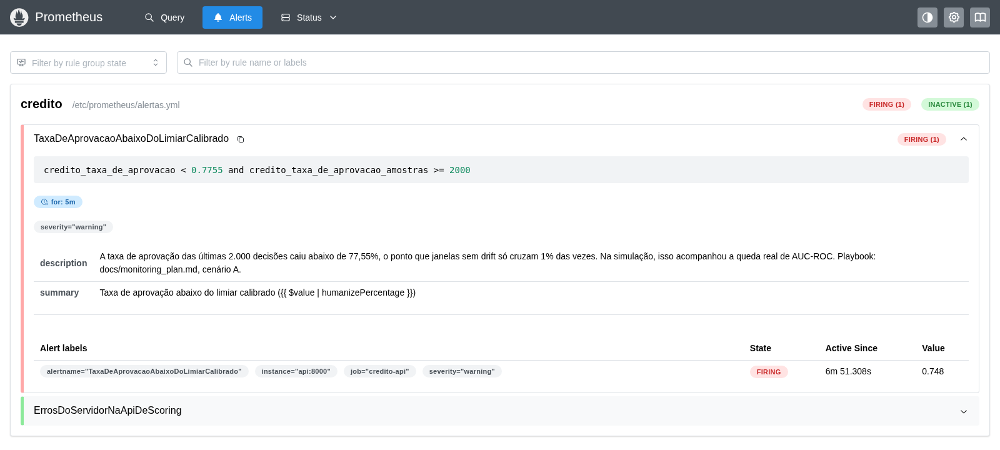

# Plano de Monitoramento — Observabilidade de Produção

| | |
|---|---|
| **Escopo** | A API de scoring instrumentada (`credito.api`) e a pilha Prometheus/Grafana em `docker-compose.yml` |
| **Dashboard** | `docker/grafana/dashboards/credito-observabilidade.json` (uid `credito-observabilidade`) |
| **Pré-requisito de leitura** | [`docs/model_card.md`](model_card.md) — em especial "Degradação sob drift" e "Limitações" |

---

## A pergunta que este plano responde

Duas medições das etapas anteriores decidem o que este documento pode e não pode prometer:

1. **Drift de feature é diagnóstico, não alarme.** As duas variáveis de maior PSI
   (`DebtRatio` e `MonthlyIncome`) explicam juntas **3,1%** da degradação real medida; o
   concept drift — invisível a qualquer PSI sobre as features — explica **48,0%**.
2. **Em produção não existe rótulo.** A degradação real (queda de AUC-ROC, de recall) só
   é mensurável porque a simulação controla o processo gerador. Um sistema real não sabe
   quem inadimpliu até meses depois da decisão.

Logo, todo limiar abaixo vem de uma pergunta só: **qual sinal, calculável sem rótulo,
mais se pareceu com a degradação real, na única situação em que há rótulo para conferir?** —
e não de convenção de mercado, exceto onde isso é dito explicitamente.

---

## Painel por painel

### 1. Tráfego e taxa de erro — o serviço está de pé?

- **Métrica:** `credito_http_requests_total{method,route,status}`.
- **O que significa:** volume por rota e a fração de respostas `5xx` — a única classe de
  erro que indica defeito do servidor, já que payload inválido responde `422`, não `5xx`.
- **Alerta e origem do limiar:** medido rodando a pilha real (540 requisições válidas e
  60 inválidas contra o campeão publicado) — **zero respostas `5xx`** nas duas rodadas de
  validação desta task. Qualquer `5xx` sustentado é, portanto, anômalo por construção:
  **o limiar operacional é `> 0` de forma sustentada** (ex.: mais de uma no mesmo minuto),
  não uma taxa percentual medida — não há histórico de erro real para calibrar uma taxa.
- **Quando disparar:** ver os logs do container `api` (`docker compose logs api`); a causa
  é bug de código ou dependência (ex.: modelo que falhou ao carregar no lifespan), nunca
  entrada do cliente.

### 2. Latência HTTP p50/p95/p99 — está respondendo rápido?

- **Métrica:** `credito_http_request_duration_seconds_bucket{method,route}`.
- **Medição real** (540 requisições válidas contra `/score`, cliente sequencial em
  loopback — **não é teste de carga concorrente**, é um smoke test): p50 6,46 ms · p95
  10,7 ms · p99 22,2 ms.
- **Alerta:** sem medição de carga concorrente real, não há SLA a declarar. O uso
  imediato é diagnóstico: comparar esta série com a latência de inferência (painel 3) para
  saber se uma lentidão vem do modelo ou do que envolve a chamada (validação do payload,
  serialização, rede). Um patamar prático para observar — não um SLA medido — é qualquer
  p99 sustentado **acima de 100 ms**, cerca de 4,5x o pior valor já observado.
- **Quando disparar:** olhar a latência de inferência (painel 3) na mesma janela. Se ela
  não subiu na mesma proporção, o gargalo está fora do modelo.

### 3. Latência de inferência — se está lento, é o modelo ou o servidor?

- **Métrica:** `credito_inference_duration_seconds_bucket` — só a chamada a
  `predict_proba`, sem HTTP em volta.
- **Achado desta validação:** a calibração original dos buckets, feita junto com a API, usou um dublê de
  modelo e foi só até 1 ms. Subindo a pilha de verdade e medindo o campeão real (XGBoost,
  300 árvores) sob as mesmas 540 requisições, **toda chamada caía no bucket `+Inf`** — o
  histograma era inútil para o modelo que de fato está publicado. Corrigido no commit
  `473ef3c`.
- **Medição real do campeão** (540 chamadas a `predict_proba`, payload variado): p50
  3,515 ms · p90 7,696 ms · p95 9,665 ms · p99 13,442 ms · máximo 17,367 ms.
- **Alerta:** mesmo raciocínio do painel 2 — patamar prático de observação, não SLA
  medido sob carga real: p99 sustentado **acima de 50 ms** (cerca de 2,9x o máximo observado e 3,7x o p99).
- **Quando disparar:** confirma que o gargalo é o modelo (troca de hardware, contenção de
  CPU do container, ou um candidato promovido com custo de inferência maior) — nunca rede
  ou serialização, que este número exclui por construção.

### 4. Distribuição do score — o modelo mudou o que devolve?

- **Métrica:** `credito_score_distribution_bucket` — histograma bruto da probabilidade de
  inadimplência devolvida, acumulado desde a subida do processo.
- **O que este painel é, e o que não é:** ele dá ao operador humano a mesma leitura
  visual que `psi_do_score` mede numericamente (deslocamento da distribuição de score),
  mas **não há hoje um número de PSI calculado ao vivo a partir dele** — a API não mantém
  uma janela de referência separada da janela atual para comparar. O cálculo numérico de
  `psi_do_score` existe (`credito.monitoring.proxies.psi_do_score`) e roda hoje só em
  lote, via `make monitor` / `scripts/validar_proxies.py`, registrado no MLflow.
  Ligar isso a uma métrica Prometheus ao vivo é decisão ainda não tomada, pela mesma razão
  declarada no painel de PSI por feature abaixo.
- **Calibração da nula, medida na Etapa 3:** os 10 bins de `psi_do_score` foram
  calibrados na Etapa 2 só para as dez features de entrada — nunca para a distribuição de
  saída do modelo, que tem forma diferente. Recalibrado agora com o mesmo método
  (`credito.drift.calibration.distribuicao_nula_psi`, 5.000 reamostras, 10 bins, semente
  42, lotes de 23.584 linhas) contra os escores do campeão sobre a Referência completa
  (117.917 linhas): **p95 = 0,000582 · p99 = 0,000752 · máximo em 5.000 medições =
  0,001210**.
- **A convenção de indústria (0,10/0,25) nunca dispararia neste dado**, nem no mês de
  maior degradação real medida: `psi_do_score` chega a 0,0291 no mês 6 (AUC-ROC já caída
  24,7%), **3,4x abaixo** do corte convencional de atenção. O limiar empírico (p99 =
  0,000752), ao contrário, já é cruzado no **mês 1** (psi = 0,001335, quando a AUC-ROC
  ainda só caiu 3,7%) — cinco meses antes de a convenção sequer se aproximar de disparar.

  | Lote | `psi_do_score` | vs. p99 empírico (0,000752) | vs. convenção (0,10) |
  |---|---:|---|---|
  | mês 1 | 0,001335 | 1,8x acima — dispara | 75x abaixo — não dispara |
  | mês 2 | 0,004849 | 6,4x acima | 21x abaixo |
  | mês 3 | 0,010662 | 14,2x acima | 9,4x abaixo |
  | mês 4 | 0,014182 | 18,9x acima | 7,0x abaixo |
  | mês 5 | 0,021979 | 29,2x acima | 4,6x abaixo |
  | mês 6 | 0,029091 | 38,7x acima | 3,4x abaixo |

- **Quando disparar** (uma vez ligado a uma métrica ao vivo — ver ressalva acima): sinal
  de confirmação para o alarme do painel 5, não substituto dele.

### 5. Taxa de aprovação — o alarme primário

- **Métrica:** `credito_taxa_de_aprovacao` (Gauge), recalculada a cada decisão sobre uma
  janela deslizante das últimas `JANELA_TAXA_DE_APROVACAO = 2.000` decisões, via
  `credito.monitoring.proxies.taxa_de_aprovacao` — nunca uma segunda implementação do
  corte de limiar. `credito_taxa_de_aprovacao_amostras` diz quantas decisões a janela já
  tem.
- **Por que este é o alarme, e não outro:** a validação de proxies (`make validar-proxies`) mediu os três sinais sem rótulo
  contra a degradação real dos seis lotes simulados. Os três empatam em concordância de
  ordem (Spearman rho = ±1,0000 contra AUC-ROC e contra lift acima do piso, **p exato de
  permutação 0,002778**, n=6 — o intervalo de confiança fechado satura perto de `|rho|=1`
  independente de `n` e por isso não decide nada aqui, só o p exato). O desempate é por
  magnitude: `taxa_de_aprovacao` tem o maior passo médio mensal (**0,0079**, contra 0,0056
  de `psi_do_score` e 0,0033 de `confianca_media`) — é o proxy que mais se move por mês de
  degradação real, o que faz dele o sinal mais forte para um alarme binário.
- **Faixa medida nos seis lotes** (23.584 scores por lote, campeão real, sem retreino):

  | Lote | Taxa de aprovação | AUC-ROC real |
  |---|---:|---:|
  | mês 1 | 78,50% | 0,8109 |
  | mês 2 | 77,53% | 0,7686 |
  | mês 3 | 76,73% | 0,7279 |
  | mês 4 | 76,06% | 0,6992 |
  | mês 5 | 75,29% | 0,6645 |
  | mês 6 | 74,55% | 0,6342 |

  Queda de 3,94 pontos percentuais em 6 meses (−5,02% relativo), passo médio 0,79 p.p./mês.
- **O limiar e a janela, medidos** (`make calibrar-alarme`). A validação acima é sobre lotes
  mensais de 23.584 decisões; a API lê uma janela muito menor e, portanto, mais ruidosa. Um
  limiar herdado da escala mensal não diria nada sobre ela — então a janela foi calibrada:
  sorteando janelas do mês 0, sem drift, a nula mostra quanto a taxa oscila só por acaso; o
  limiar fica na cauda de 1% de falso alarme; e em cada mês de drift mede-se que fração das
  janelas cai abaixo dele.

  | Janela | Desvio sem drift | Limiar | Mês 1 | Mês 2 | Mês 3 | Mês 4 | Mês 5 | Mês 6 |
  |---:|---:|---:|---:|---:|---:|---:|---:|---:|
  | 500 | 1,80 p.p. | 0,7560 | 5,7% | 13,9% | 25,4% | 38,7% | 54,5% | 68,1% |
  | **2.000** | 0,89 p.p. | **0,7755** | 14,9% | 48,9% | **79,5%** | **94,1%** | 99,3% | 100,0% |
  | 5.000 | 0,56 p.p. | 0,7828 | 35,0% | 89,8% | 99,5% | 100,0% | 100,0% | 100,0% |

  **A janela era de 500, por convenção — e era fraca.** O ruído dela (1,8 p.p.) é maior que
  a queda de um mês inteiro de degradação (0,79 p.p.): mesmo no mês 6, com a AUC-ROC 24,7%
  abaixo, um terço das janelas não disparava. Passou a **2.000**, a menor janela medida que
  dispara na maioria das janelas a partir do mês 3. A de 5.000 detecta antes, ao custo de
  2,5x mais decisões para encher a janela; a escolha certa depende do volume de tráfego, que
  este projeto não mede — a tabela está aqui para quem operar decidir pelo próprio volume.
  A taxa de 1% de falso alarme por janela é convenção declarada, como o alfa de 0,05.
- **A regra de alerta** (`docker/prometheus/alertas.yml`, provisionada por arquivo):
  `TaxaDeAprovacaoAbaixoDoLimiarCalibrado` dispara com a taxa abaixo de 0,7755 **e** a
  janela cheia (2.000 decisões), sustentado por 5 minutos — o `for` é convenção
  operacional contra pico isolado, não medição. Testada com `promtool test rules`
  (`alertas_test.yml`, no CI): dispara no caso que deve, e não dispara com janela
  incompleta nem exatamente no limiar. Um teste trava limiar e janela iguais entre o código,
  a regra e a linha tracejada do painel; `make calibrar-alarme` falha se um retreino do
  campeão mudar o limiar medido.
- **Visto disparando, ao vivo:** com a pilha de pé, 2.500 decisões do mês 0
  (`make traffic LOTE=mes_00`) deixaram a taxa em 79,9% e nenhum alerta; 2.500 do mês 6
  (`LOTE=mes_06`) a levaram a 74,8%, e o alerta passou a *firing* depois dos 5 minutos.

  
- **Quando disparar:** confirmar que não é mudança de configuração (o `limiar` de decisão
  mudou?) nem uma fatia de tráfego atipicamente diferente (ex.: um único cliente
  disparando um volume fora do padrão); comparar com a distribuição do score (painel 4);
  se persistir, rodar `make validar-proxies` para o número calibrado sobre a granularidade
  medida antes de escalar.

### 6. PSI por feature — diagnóstico: se o alarme tocou, de onde veio?

- **Painel deliberadamente textual no dashboard**, sem métrica Prometheus ao vivo: o PSI
  por feature é calculado em lote (`credito.drift.statistics.psi`, dentro de
  `credito.pipeline.monitoring`) e registrado no MLflow a cada execução — a API de
  scoring responde requisição a requisição e não recalcula PSI contra a Referência
  completa a cada chamada. Ligar isso a um `Gauge`/pushgateway é decisão ainda não tomada.
- **Nula empírica publicada na Etapa 2** (README, `config.py:61-83`): pior p95 entre as
  dez features 0,001610 (`NumberRealEstateLoansOrLines`), pior p99 0,001978 — a convenção
  `psi_atencao=0,10` está **62x** acima do p95 medido e `psi_critico=0,25` está **126x**
  acima do p99. **Esta nula não alimenta nenhum limiar no gate de features hoje** — é
  dívida declarada no próprio `config.py`: cortar em 0,0016 transformaria variação
  amostral irrelevante em alarme diário.
- **A armadilha que este painel existe para prevenir:** as duas features de PSI mais alto
  (`DebtRatio` 0,5046 e `MonthlyIncome` 0,2634) respondem por apenas **3,1%** da
  degradação real medida no mês 6; o concept drift — que nenhum PSI de feature enxerga,
  porque não desloca `P(X)` — responde por **48,0%**, e a interação entre os canais por
  **42,1%**. **Um PSI de feature alto não diz que aquela feature é a causa mais provável
  da degradação — diz só que a distribuição de entrada dela se moveu.**
- **Quando consultar:** depois que o painel 5 (ou 4) já indicou que algo degradou — nunca
  antes. A ordem de leitura é deliberada.

### 7 e 8. Estabilidade da infraestrutura — o processo está de pé, com folga?

- **Métricas:** `up{job="credito-api"}` (o Prometheus consegue raspar a API),
  `process_cpu_seconds_total` (CPU, em taxa: fração de um núcleo),
  `process_resident_memory_bytes` (memória residente) e `process_start_time_seconds` (um
  reinício aparece como salto). Vêm do coletor de processo do `prometheus-client`,
  registrado no registro próprio da API.
- **Medido na demonstração:** sob 5.000 decisões sequenciais, CPU com pico de ~40% de um
  núcleo e memória estável em ~195 MiB.
- **Alerta:** `up` em 0 é a API fora — a primeira coisa a olhar em qualquer cenário. Para
  CPU e memória, sem carga real medida, não há limiar a declarar; o sinal é a forma da
  curva: memória crescendo sem parar entre reinícios é vazamento.

---

## Logs de execução dos pipelines (MLflow)

O painel acima é a saúde do serviço; a saúde dos **pipelines** de dados mora no MLflow,
um run por execução de `make train` (experimento `credito-treino`) e de `make monitor`
(`credito-monitoramento`), aberto no início — uma falha no meio deixa o run `FAILED` com a
causa, em vez de nenhum rastro (`credito.tracking.execucao`).

| Métrica de saúde do pipeline | Onde | Como ler |
|---|---|---|
| **Status da execução** | status do run (`FINISHED`/`FAILED`) e tag `desfecho` | `falha` é defeito; `nao_promovido` é decisão do gate e termina `FINISHED` |
| **Causa da falha** | tags `falha.tipo` e `falha.mensagem` | `ContratoViolado` aponta o dado; `QualityGateError`, o modelo |
| **Status de cada tarefa** | métricas `tarefa.<nome>` (1/0), no passo do mês quando por lote | a tarefa que parou é a primeira em 0 |
| **Volume processado** | `volume.linhas_brutas`, `volume.linhas_referencia`, `volume.linhas_lote` (por mês) | queda brusca de volume é problema de ingestão antes de ser de modelo |
| **Volume recusado** | `volume.descartes.<motivo>` (limpeza) e `volume.linhas_reprovadas` (contrato) | um motivo de descarte que cresce é o sistema de origem mudando |
| **Resultado do drift** | `drift.psi.<feature>`, `campeao.*` e `proxy.*` por mês; tag `gate.veredito` | ver painéis 4 a 6 e a seção da causalidade no README |
| **Alertas de falha ou drift** | Prometheus, série `ALERTS{alertstate="firing"}`, e a página `/alerts` | quantos e quais dos alertas de `alertas.yml` estão disparando agora |

Visto com o dado real: um treino com o piso de AUC-PR forçado a 0,99 aparece `FAILED`, com
`falha.tipo = QualityGateError`, `tarefa.gate = 0` e o volume da execução completo — ver
`docs/images/mlflow-treino-falha.png`.

---

## Playbook por cenário

### A. Alerta `TaxaDeAprovacaoAbaixoDoLimiarCalibrado` (painel 5)

**Primeira pergunta:** a janela está cheia e a queda se sustenta? O alerta só dispara assim —
e nessa condição, janelas sem drift só cruzam o limiar 1% das vezes; na simulação, a
travessia acompanhou a queda real de AUC-ROC.

1. Confirmar que não é uma mudança de configuração (limiar de decisão, versão do modelo
   servido — `credito_model_info`).
2. Olhar a distribuição do score (painel 4): o formato inteiro se deslocou, ou só a cauda
   perto do limiar de decisão?
3. Separar mudança de mix de degradação: um canal novo de aquisição, uma campanha para um
   público diferente, derrubam a aprovação sem que o modelo tenha piorado. A taxa de
   aprovação não distingue os dois — essa é a limitação dela como alarme sem rótulo.
4. Se não houver explicação de mix, escalar: avaliar retreino com o gate de promoção e
   acompanhar a degradação real quando o rótulo chegar.

### B. Alerta `ErrosDoServidorNaApiDeScoring` (painel 1)

**Primeira pergunta:** é `503` ou outro `5xx`? Erro de entrada do cliente já seria `422`,
nunca `5xx`.

1. **`503`: o registro de decisão não gravou, e nenhuma decisão está sendo emitida** — por
   desenho: uma decisão sem registro não poderia ser revista (LGPD, art. 20). Verificar o
   volume `decisoes` (disco cheio, permissão) — `docker compose logs api` mostra
   "decisão não registrada".
2. Outro `5xx`: `docker compose logs api` — a exceção real está no traceback.
3. Confirmar que o modelo carregou no lifespan (`/health` responde `200`?).

### C. Latência subiu (painéis 2 e 3)

**Primeira pergunta:** a latência de inferência (painel 3) subiu na mesma proporção da
latência HTTP total (painel 2)?

1. Se sim → o gargalo é o modelo: contenção de CPU do container, ou um candidato
   promovido com custo de inferência maior que o campeão atual (p99 medido 13,4 ms).
2. Se a latência HTTP subiu muito mais que a de inferência → o gargalo está fora do
   modelo (validação do payload, serialização da resposta, rede).

### D. Uma feature específica cruzou a nula de PSI (painel 6, quando ligado)

**Primeira pergunta:** essa feature está no canal de atribuição causal medido (renda,
dívida, atraso)? Quanto ela sozinha explicou da degradação real no mês de maior
degradação (0,8% / 2,3% / 6,8%, respectivamente)?

1. PSI alto não é, por si, veredito de que o modelo piorou — olhar os painéis 4 e 5
   primeiro para saber **se** piorou.
2. Se nenhuma feature isolada explica uma queda visível em taxa de aprovação ou
   distribuição do score, a causa provável é concept drift — que nenhum PSI de feature
   captura.

### E. Um run `FAILED` no MLflow

**Primeira pergunta:** qual é o `falha.tipo`?

1. `ContratoViolado` (ou `ReferenciaInvalida`, no monitoramento): o dado foi recusado na
   porta. A métrica `tarefa.contrato` em 0 aponta o mês; `volume.linhas_reprovadas`, quantas
   linhas. A causa está no sistema de origem — nada foi treinado nem monitorado sobre ele.
2. `QualityGateError`: o candidato violou um piso absoluto. Nada foi publicado; o modelo em
   produção continua o anterior. Comparar `teste.*` do run com os pisos nos parâmetros.
3. Qualquer outro tipo é defeito de código: a mensagem está em `falha.mensagem`, e o
   traceback completo no log da execução.
---

## O que não é monitorado, e por quê

- **Degradação real (AUC-ROC, recall) não pode ser medida em produção.** O rótulo
  ("dificuldade financeira grave") só é observável dois anos depois da decisão. Todo
  limiar acima é um proxy validado numa simulação com rótulo — nunca confirmado contra
  produção real, porque nenhum sistema real tem acesso a essa confirmação a tempo.
- **A concordância perfeita medida (rho = ±1, n = 6) é evidência dentro do regime de
  drift que este projeto simula** (deslocamento gradual de renda/dívida/atraso mais
  concept drift específico) — não garante que os mesmos proxies antecipem qualquer outro
  padrão de degradação real. Um tipo de drift diferente do simulado poderia mover a taxa
  de aprovação de outra forma, ou não movê-la.
- **O poder do alarme foi medido sobre a mudança que este projeto simula.** Com a janela de
  2.000, ele pega 14,9% das janelas no primeiro mês e 79,5% no terceiro: a degradação
  precoce passa, na maior parte das janelas, despercebida. E uma mudança de mix de clientes
  move a taxa de aprovação sem degradação nenhuma — ver o playbook, cenário A.
- **Disparidade por faixa etária** (medida no model card: recusa varia 4,7x entre faixas
  contra 2,7x de variação no risco real) **não tem métrica de produção dedicada** —
  nenhum painel desta pilha monitora disparidade em tempo real.
- **PSI por feature e PSI do score ao vivo, como métrica Prometheus numérica**, não estão
  implementados — ambos rodam hoje em lote (MLflow). Decidir a via concreta (job em lote
  escrevendo um `Gauge`/pushgateway, ou um exportador lendo o último cálculo do MLflow)
  é decisão ainda não tomada.

---

## Fontes e reprodutibilidade

| Número | Fonte | Como reproduzir |
|---|---|---|
| Taxa de aprovação e `psi_do_score` por lote | `reports/validacao_de_proxy.json` | `make validar-proxies` |
| Degradação real (AUC-ROC) por lote | `reports/monitoramento.json` | `make monitor` |
| Nula empírica do PSI de feature | `README.md`, `src/credito/config.py:61-83` | calibração publicada na Etapa 2 |
| Nula empírica do PSI do score | `credito.drift.calibration.distribuicao_nula_psi` sobre os escores do campeão na Referência completa (117.917 linhas), 5.000 reamostras, 10 bins, semente 42, lotes de 23.584 | `make calibrar-alarme` → `reports/calibracao_do_alarme.json` |
| Limiar e poder do alarme por janela | nula da taxa de aprovação em janelas do mês 0 e poder por mês de drift, 5.000 janelas, semente 42 | `make calibrar-alarme` → `reports/calibracao_do_alarme.json` |
| Latência HTTP e de inferência | Medida subindo `docker-compose.yml` de verdade e gerando 540 requisições reais contra o campeão publicado | ver commit `473ef3c`; reproduzir com `docker compose up -d` e tráfego real contra `/score` |
